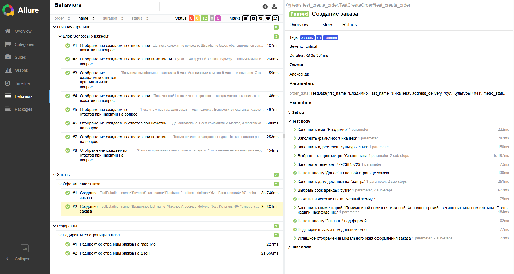

# Sprint_6

## О проекте

Учебный проект с UI-автотестами для сайта 'Яндекс Самокат'.
Тесты написаны на Python с использованием pytest и Allure и запускаются локально.

## Состав тестов

- `tests/test_accordion_with_questions.py`
  - Проверяет блок FAQ на главной странице.
  - Для каждого вопроса (параметризация через `data/accordion_faq_data.py`) кликает по вопросу и сверяет отображаемый ответ с ожидаемым текстом.

- `tests/test_create_order.py`
  - Проверяет создание заказа через форму.
  - Тест параметризован данными из `data/order_data.py` (разные варианты имени, адреса, даты, срока аренды, цвета и комментария).
  - Сценарий: заполнение первой страницы формы → переход на вторую → заполнение → подтверждение заказа → проверка текста успешного оформления.

- `tests/test_redirect_from_order.py`
  - Проверяет редиректы со страницы заказа.
  - Редирект по клику на логотип «Самокат» возвращает на главную страницу (проверка URL).
  - Редирект по клику на логотип «Яндекс» открывает Дзен в новой вкладке (проверка заголовка страницы).

## Установка зависимостей
Зависимости устанавливаются из файла `requirements.txt`.

```
python -m pip install -r requirements.txt
```

## Запуск тестов с указанием окружения `ENV`
Переменная окружения `ENV` выбирает стенд в `core/config.py`. Доступные значения: `prod` (по умолчанию), `dev`.

### Параллельный запуск (4 потока)
По умолчанию тесты запускаются в 4 потока за счёт `pytest-xdist` — это настроено в `pytest.ini` (параметр `addopts = -n 4`). При необходимости измените число потоков в `pytest.ini`.

### Bash (Linux/macOS/Git Bash)
```bash
# разово для команды
ENV=dev pytest

# запуск тестов с Allure-результатами
ENV=dev pytest tests --alluredir=allure_results

# просмотр отчёта
allure serve allure_results
```

### Windows
**PowerShell**
```powershell
$env:ENV = "dev"
pytest

# запуск тестов с Allure-результатами
pytest tests --alluredir=allure_results

# просмотр отчёта
allure serve allure_results
```

**CMD**
```cmd
set ENV=dev
pytest tests --alluredir=allure_results
allure serve allure_results
```

## Результаты тестов

